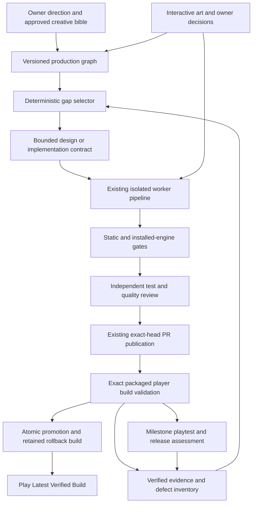

# Target architecture: autonomous production of the Star Wars trilogy

Design date: 2026-09-26. Inspected local baseline: `d356dab1bf61b749669502ec2776fd580640781d`.
Unattended-delivery refinement: 2026-09-27.

This is the target design and implementation direction requested by the project
owner. It is not a claim that the components below exist or that the mod has
passed playtesting. Adoption requires a reviewed reference-governance change to
the canonical scope and orchestration specifications, with synchronized DOCX
counterparts and manifest. Local adoption edits are pending until that process
completes. Those controlled specifications remain authoritative. The design grants
no new runtime policy, publication authority, model route, or credential handling.

## 1. The architectural decision

Build a production system that closes verified gaps in a complete game. Retain
the deterministic ticket executor, but give it a versioned product plan, a
dependency graph, and evidence of playable outcomes. Ticket throughput is an
operational measure; finished, enjoyable campaign experiences are the objective.

The owner-facing delivery promise is: improve an approved playable milestone,
verify it, and leave the newest eligible build ready to launch when the owner
returns. A failed or interrupted run preserves the previous eligible build.
The first delivery target is a connected three-mission prototype selected from
existing content, followed by the 3-5 mission production proof. The detailed
contract is [Unattended development and playable build delivery](UNATTENDED_DELIVERY_SPEC.md).

The product remains the original, serious-toned, post-ROTJ Legends total
conversion already defined in the scope: three campaigns, approximately 25-30
missions, ground and space combat, squads, heroes, vehicles, and off-map sorties.
All dialogue, code, artwork, and audio must be original. Existing published IDs
remain compatibility contracts; new project-owned WML/Lua IDs use `sw_`.

Autonomy means the system can select, implement, verify, integrate, and improve
bounded work within approved direction. It must also know when evidence is
insufficient, an asset is awaiting an interactive tool, or an owner decision is
required. Autonomous code production alone cannot certify fun or artistic quality.

## 2. What the repository actually contains

The following are source-inspection findings, not fresh engine or remote-CI results.
The local working copy was on `main`, matching its local `origin/main` tracking
reference; the remote was not refreshed. An existing untracked handoff was preserved.

| Evidence at the inspected revision | Architectural consequence |
| --- | --- |
| `_main.cfg` registers two campaigns; `scenarios/` contains 21 scenario CFG files | Audit and finish existing content before treating more scenario files as progress. Campaign III is not registered in this snapshot. |
| Unit definitions live in four category files; `lua/` contains a README | Build shared gameplay services incrementally from concrete duplicated behavior. Do not assume a reusable Lua runtime already exists. |
| `tests/gameplay-contracts.json` contains 47 contracts | Preserve existing regression coverage while adding evidence of actual outcomes. |
| `gameplay_contracts.py` checks `source-id` and `event-unit` by inspecting text | These checks prove structural retention, not that an event fires or a mission is winnable. |
| `ticket_acceptance.py` adds baseline-aware source, placement, event-text, and map claims | Keep proof that a ticket changes something, but distinguish it from proof that the change works during play. |
| `scenario_launch_selftest.py` stages add-ons, preprocesses, probes scenarios, and checks the player launcher | Extend this installed-engine boundary; avoid building a second competing validation pipeline. |
| `art_pipeline.py` tracks interactive Codex generation and full 13-file unit sets | Asset production has a real handoff boundary. Pending art cannot count as finished presentation. |
| `autonomy.py` already selects recorded contracts, resumes work, and refills an exhausted backlog | Add product-gap selection ahead of the existing ticket workflow. Do not replace its proven execution controls. |
| Canonical scope describes the initial foundation; continuity contains both later milestones and obsolete “not completed” sections | Separate current facts, historical records, and future intent. Prose snapshots must not decide mutable completion state. |
| Orchestration section 5 and stage 6 describe different reviewer fallback chains | Resolve this explicitly in reference adoption; architecture must not silently choose a new routing policy. |

Representative content illustrates the maturity gap: `21_restore_the_beacon.cfg`
is a small terminal-access encounter, and `units/infantry.cfg` still includes a
stock peasant image reference and a prototype Phalanx with a pike. These are
useful foundations to assess and improve, not evidence of finished Star Wars
presentation or campaign depth. No estimate of percentage complete follows from
the file count.

## 3. System boundaries



Implement this as a modular Python application on the existing host, with WML/Lua
in the shipped add-on. No microservices, new credentials, external vector store,
or runtime model dependency is required. The installed game must work offline
without Python, Codex, the dashboard, or access to development services.

| Component | Owns | Does not own |
| --- | --- | --- |
| Product director role | Proposed milestone goals, creative consistency, gap analysis | Completion verdicts, mutable runtime state, merges |
| Production graph | Reviewed design requirements and dependency relationships | Self-reported completion flags from a worker |
| Deterministic scheduler | Eligible work, resource limits, leases, contract selection | Creative judgments or rewriting acceptance after failure |
| Bounded specialists | Scenario, systems, narrative, map, asset, UX, or balance artifacts | Tests, arbitrary delegation, publication, governance |
| Test designer and independent critic | Probes, counterexamples, quality findings | Implementing the candidate under review or overriding failing gates |
| Existing executor and publisher | Worktrees, scope, actual command execution, review, CI, protected publication | Product scope expansion |
| Durable supervisor | Single process owner, host preflight, checkpoints, bounded restart and side-effect reconciliation | Relaxing global pauses or changing credentials |
| Player build manager | Immutable packages, verified promotion, launch identity, save isolation, rollback | Treating development staging as a verified installation |
| Evidence store and dashboard | Verified readiness, blockers, history, player-build identity | Inferring PASS from prose, tool availability, or process survival |

These are responsibility boundaries, not a mandate for seven always-running
agents. Start with sequential dispatch through existing supported roles. New
specialist profiles require explicit policy and integration work. Workers never
spawn other workers. Route models through the existing approved application and
provider policy; select by role capability rather than baking model names into
campaign design.

## 4. Versioned product memory

Add a small `production/` tree outside the shipped add-on:

```text
production/
  schemas/                 Strict schemas and schema migration rules
  vision.md                Product pillars, audience, tone, explicit exclusions
  narrative/               Trilogy outline, character bible, original story beats
  systems/                 Mechanics contracts and capability evidence requirements
  campaigns/               Campaign graphs and individual mission design records
  rosters/                 Faction roles, counters, availability, advancement
  assets/                  Asset requirements, style guide, provenance records
  milestones/              Required nodes, exit gates, playtest rubrics
```

Use JSON for machine-consumed records and Markdown for authored explanation.
Reuse the existing add-on art queue through stable asset IDs; do not create two
authoritative asset status files. Runtime attempts, process state, and logs stay
under ignored `agent/runtime/`; committed production files describe intended
content and requirements. Durable release summaries identify evidence hashes and
commit identities without committing raw logs or credentials.

Every product node has a stable ID, kind, design revision, milestone membership,
source paths, dependencies, acceptance requirement IDs, required assets, and
impact relationships. Reject duplicate IDs, unknown dependencies, dependency
cycles, unsafe paths, and unbounded nested input. Separate dependency edges
(`requires`) from campaign transitions (`next`, `branch`) because replayable
mission graphs may legitimately contain loops that production dependencies may not.

Mission records must specify:

- narrative purpose, viewpoint, participating characters, and original story beats;
- tactical question, ground/space mode, objective sequence, map landmarks, and
  the meaningful choices that distinguish this mission from its neighbors;
- win/loss conditions, optional outcomes, triggers, and exploit cases;
- initial units, recruit/recall restrictions, reinforcements, and difficulty variants;
- inputs and outputs for campaign state, hero survival, resources, and transitions;
- dialogue, briefing/debriefing, tutorial needs, art/audio dependencies, and UX needs;
- expected runtime evidence, balance questions, and independent review rubric.

Keep WML as the single executable source. Product records are design and
validation inputs, not a parallel implementation language. Initially check their
IDs, links, and requirements against source; do not introduce a general WML
generator. If a later narrow generator is justified, each field must have one
owner and deterministic regeneration tests.

The narrative bible defines the trilogy's major beats, character voices,
faction motives, and boundaries on adaptation. Mission authors receive only
relevant excerpts plus neighboring mission summaries. Broad lore names and
concepts are permitted; copied prose, close paraphrase, and licensed assets are
not. A narrative review checks continuity and tactical relevance, not just spelling.

## 5. Readiness is derived from evidence

Track independent dimensions for every mission or system:

| Dimension | Minimum evidence for readiness |
| --- | --- |
| Design | Reviewed mission/system contract with resolved critical questions |
| Implementation | Scoped changes integrated into a known revision |
| Runtime behavior | Required installed-engine behavior probes pass |
| Campaign integration | Valid predecessor/successor state, carryover, and save/load evidence |
| Presentation | Required final assets, animation wiring, readability, and audio review |
| Play quality | Difficulty and playtest rubric met; critical defects closed |
| Release | Present and verified in the exact distributable/player build |

Each dimension can be `missing`, `in_progress`, `blocked`, `verified`, or `stale`.
A published ticket does not automatically verify its parent mission. A milestone
is complete only when every required node and exit gate is verified; exclusions
require a reviewed scope change. Display counts by dimension, not one misleading
“percent complete” calculated from ticket count.

Evidence identity includes candidate tree/commit, engine build, test harness
revision, requirement revision, dependency digest, seed, difficulty, scenario,
probe ID, actual exit status, bounded observations, and retained artifact digest.
Missing or stale evidence is not a pass. Worker messages cannot write verified state.

Invalidate evidence transitively: a shared weapon or carryover change affects
every consuming mission; a sprite change affects presentation and resource tests;
a narrative change affects dependent continuity checks. An unrelated dashboard
change need not rerun all gameplay, unless it changes staging or validation.
Unknown dependencies conservatively require the broader applicable suite. Reuse
must record the previous evidence identity and why all relevant inputs match.

The existing 100-contract limit in `validate_declared_contracts` is a concrete
scaling constraint. Introduce bounded per-system/per-mission contract files and a
validated index before production outgrows it; retain global duplicate and
coverage checks. Do not silently truncate contracts or simply remove all limits.

## 6. Game runtime architecture

Keep `_main.cfg` as a thin loader. Preserve existing campaign defines, scenario
IDs, save compatibility, and include ordering during incremental migration.
Only add new directories/modules when a ticket moves concrete behavior into them.

| Layer | Responsibility |
| --- | --- |
| Engine adapter | Small version-tested wrappers around required Wesnoth APIs; fail clearly on unsupported required capabilities |
| Shared rules | Range, cover, shields, suppression if approved, command effects, support sorties, and common targeting predicates |
| Mode rules | Ground and space movement, terrain, weapon interactions, and AI policies |
| Content definitions | Factions, squads, heroes, vehicles, spacecraft, weapons, and advancement |
| Mission services | Objective transitions, reinforcements, escort/extraction, interactables, and timed events |
| Campaign state | Versioned persistent state, roster/carryover, difficulty, and transitions |
| Presentation | Player-facing objectives, range/ability feedback, dialogue, animation, and audio |
| Campaign scenarios | Authored maps, encounters, dialogue, and configuration of shared services |

Use declarative WML for content and straightforward events; use Lua where shared
stateful behavior warrants it. Avoid a universal mission framework before two
real missions need the same abstraction. Ground and space share interfaces and
campaign state, while retaining distinct rules and tactical identities.

Every shared mechanic has a contract: legal targets, costs, timing, state
lifetime, stacking, AI behavior, UI feedback, save/load behavior, and probes.
For example, an off-map sortie needs an eligibility predicate, atomic cost and
cooldown handling, legal-target feedback, an AI decision path where applicable,
and tests for cancellation, duplicate invocation, and reloading mid-cooldown.

Use one rules predicate for UI previews, execution validation, and AI eligibility.
Centralize tunable values by mechanic/weapon family to avoid scenario copies
drifting. All combat remains turn-based and single-hex in logical occupancy.
Large walkers and capital ships use explicit set-piece contracts.

Persistent campaign state uses a versioned `sw_` namespace and declared variable
lifetimes. Separate scenario-local flags from cross-scenario state; initialize
defaults, clear local variables, and make one-shot rewards idempotent. Preserve
engine-owned unit/recall state instead of duplicating it in a competing ledger.
Define how campaign boundaries import or reset progression before wiring them.
Use engine-supported synchronized randomness; record seeds for tests. No wall
clock, network call, or external model may affect a running game's decisions.

Treat native range, GUI, and AI support as capability questions requiring probes
on the supported installed build. The design does not assume an API works because
an older reference says it does. Version upgrades get their own compatibility
ticket and evidence matrix.

## 7. Autonomous planning and execution loop

1. Reconcile trusted Git, worktrees, queue, PRs, reference identity, capability
   availability, and existing evidence. Preserve unfinished contracts and hard stops.
2. Resolve eligible repairs/resumptions using current policy before new work.
3. Compute unmet requirements for the current approved milestone.
4. Filter for satisfied dependencies, path ownership, available capabilities,
   approved scope, budget, and existing pause conditions.
5. Select deterministically: release-blocking regressions first, then prerequisites
   unlocking the current playable slice, then missing slice quality, then expansion.
   Break ties with explicit milestone priority and stable node ID.
6. Reuse a validated bounded contract when one exists. Ask the planning role only
   to resolve genuine ambiguity or compile a small batch from selected gaps.
7. Validate each proposal against the product graph and current baseline. Require
   a concrete player outcome and existing or separately planned validation capability.
8. Run the existing isolated executor, deterministic gates, independent roles,
   publication controls, and player-build validation.
9. Attach evidence to requirement IDs, derive readiness, and select the next gap.

The contract extension adds `product_node_ids`, `requirement_ids`,
`design_revision`, `dependency_fingerprint`, `expected_evidence`,
`resource_budget`, and `stop_conditions` alongside existing ticket fields.
These are proposed schema additions, not valid fields to send to today's runner.

Example: “Make beacon restoration impossible after the engineer is killed;
verify valid completion, wrong-unit rejection, engineer-death defeat, and
save/reload before interaction.” This closes a gameplay requirement. “Add another
briefing message” is justified only if it closes a specific comprehension gap.

Do not invent a replacement objective when acceptance fails. A bad contract is
a planning defect; preserve it and create a linked corrected revision through
the appropriate authority. A no-op ticket is redundant. Neither is a reason to
manufacture changes or repeatedly spend code-repair attempts.

Keep existing two-attempt recovery and three-consecutive-worktree-failure pause
boundaries. Provider failures remain distinct from content defects. The scheduler
must not work around a mandatory global pause by selecting an unrelated ticket.
An unavailable asset capability may leave an ordinary dependency blocked while
other eligible work continues, only when current policy permits that continuation.

Start with one write worker and one publication lane. Later concurrency requires
explicit adoption, durable path leases, bounded account usage, independent
worktrees, and base reconciliation. Shared unit files, loaders, and global
contracts are serialization points until deliberately split. Publication remains
ordered and validates the actual candidate against current integration state.

Each run has persisted model-call, elapsed-time, engine-run, and repair budgets.
Exhaustion preserves evidence and stops at a safe boundary. A repeating failure
fingerprint or multiple tickets with no newly verified requirement becomes a
visible planning-quality issue. Budget policy must not remove mandatory checks.

Before unattended activation, bind the run to a reviewed operating charter with
an outcome, delivery profile, allowed actions, available capabilities, explicit
limits, and decision defaults. Reserve budget for integration, testing, and
packaging. A completion cutoff stops expansion early enough to attempt delivery;
it never converts incomplete evidence into PASS. Existing publication authority
is reused where applicable; additional authority requires controlled adoption.

## 8. Validation that reaches gameplay

Keep separate gate names and claims:

1. **Structure:** paths, references, WML parsing, IDs, assets, dependency graph.
2. **Launch:** exact scenario and difficulty instantiate in the installed engine,
   with positive startup evidence and no fatal diagnostics.
3. **Behavior:** controlled actions produce expected engine-observed state changes.
4. **Sequence:** real victory/defeat transitions, carryover, and save/load work
   across missions and campaign boundaries.
5. **Play quality:** seeded runs, curated playthroughs, and independent review
   assess tactical choices, pacing, balance, clarity, and presentation.
6. **Release:** clean-userdata installation and the exact packaged/player build
   satisfy the selected engine/version matrix.

Implement a capability spike before promising a headless campaign simulator.
Determine which scenario setup, action injection, observation, replay, and
save/load hooks the installed engine actually supports. Use isolated test
userdata and test-only instrumentation, excluded from the release package.
Where automation is unavailable, record a reproducible manual check as pending;
never report it as an automated pass. Directly firing a victory event tests its
handler, not that legal player actions can reach it; record those separately.

Initial behavior probes cover reachable victory, each explicit defeat condition,
wrong-unit/wrong-side objective access, one-shot rewards, reinforcement timing,
out-of-range actions, support costs, and state after reload. Add negative fixtures
that intentionally break a trigger or make an objective unreachable so the
harness demonstrates it can detect failure. Run fixtures only in isolated test data.

Test design and expected outcomes are reviewed independently of implementation.
Workers cannot weaken accepted requirements to make their own candidate pass.
Static source assertions remain useful compatibility checks but must not satisfy
a runtime requirement.

For balance, define approved difficulty-specific target bands after measuring
the slice. Record seeds, sample size, player/bot policy, completion rate, turns,
losses, resource carryover, objective failures, and repeated tactics. Bot wins
alone cannot establish human fairness or fun. Unknown or unmeasured bands remain
unverified; avoid inventing universal win-rate targets. Balance tickets change a
bounded parameter family and compare against a retained baseline and held-out seeds.

## 9. Art, audio, and coherent presentation

The style bible specifies faction silhouettes, palette, lighting, scale, portrait
treatment, animation registration, terrain readability, and UI language. Each
asset references its owning unit/mission, approved brief revision, required
states, source/provenance, allowed use, and quality evidence.

Retain today's full 13-file unit contract until a deliberate governance change
defines alternatives. A decoded PNG at the correct dimensions is not proof of
usable art: verify visible coverage, consistent scale and alignment, distinguishable
factions, attack/movement continuity, and appearance against real map backgrounds.
Placeholder and stock medieval presentation must remain explicitly marked and
cannot satisfy final Star Wars presentation requirements.

Asset stages are requested, capability-waiting, generating, import-ready,
technically verified, visually reviewed, and integrated. Adapt these onto the
existing queue without allowing a model to write final PASS. Deduplicate by asset
ID and brief hash; group only permitted complete imports sharing a source file.

Interactive Codex image generation remains an owner-facing handoff under current
policy. An unattended provider adapter would require separately approved capability,
cost, credential, and originality rules. This architecture does not assume that
such an adapter exists or authorize adding one. Until then, art waiting time is
visible and release readiness remains blocked where required.

Audio needs its own original-production briefs, provenance, loop/level checks,
event wiring, and in-game review. Do not make voice acting mandatory by accident;
define the release audio requirement in the product plan. Missing capabilities
must be settled before scheduling a milestone that depends on them.

## 10. Durable control and useful visibility

Evolve the current JSON-based controller with versioned events and atomic state
writes before considering a new database. Keep one authoritative writer and
monotonic state revisions. Every external side effect has a stable idempotency
key bound to run, ticket, candidate, and action; record intent before execution
and reconcile actual Git/PR state after restart. Never blindly repeat a push,
merge, import, or test-launch cleanup after a timeout.

The dashboard should answer: which playable milestone is being improved, what
requirement is closing, what can be played now, what is blocked, and what specific
action is needed? Show current build identity, mission readiness dimensions,
critical dependencies, asset wait states, oldest blocker, recent regressions,
budget usage, and evidence age. Keep exact worker dispatch and publication details
available for diagnosis without making them the primary measure of progress.

Lead the owner view with **Play Latest Verified Build**, its exact identity,
delivery profile, verified coverage, and limitations. Maintain immutable player
builds separately from development staging. Promote only an eligible exact
package through an atomic pointer change; keep a usable predecessor and preserve
player saves. Pin the selected build for the lifetime of a running game. The
normal player launcher must work with development services stopped and must not
silently refresh itself from uncommitted source. A separate developer launcher
may retain the current local-playtest behavior.

The supervisor preflights host/session capabilities and reconciles actual state
after crashes before retrying external actions. Qualify required GUI behavior
on the supported locked-desktop/session configuration. Use bounded retries and
persist budgets and failure fingerprints. Unavailable authentication or required
desktop capabilities remain explicit blockers; never disable security to keep
working. See the delivery specification for promotion, rollback, process
ownership, save compatibility, and failure-injection acceptance.

Protect production schemas, milestone exit gates, and accepted creative direction
from ordinary implementation workers. Mission-authoring tickets can edit bounded
mission specifications, but milestone acceptance and validated expectations require
independent review. Hash the relevant production inputs into each dispatched ticket.
Models consume a compact task-specific package, not the entire historical ledger.

## 11. Production and release milestones

| Milestone | Exit requirement |
| --- | --- |
| Evidence-backed inventory | All existing scenarios, units, assets, transitions, and current evidence mapped; unknowns explicit; three-campaign outline reviewed |
| First playable delivery, three existing missions | Approved prototype profile; connected legal-play sequence, defeat/save/load/carryover evidence, packaged build, stable launcher, and rollback; remaining quality dimensions explicit |
| Unattended qualification | A bounded real run delivers a verified improvement without routine owner intervention; restart, failure, budget, and supported desktop conditions pass the delivery-specification matrix |
| Production proof, 3-5 existing missions | A coherent ground/space sequence completes through legal play; shared rules, save/load, final representative assets, and feedback loop demonstrated |
| Vertical slice, 6-8 missions | Representative ground, space, heroes, vehicle/support, infiltration/escort, narrative, UI, and presentation meet one agreed quality bar |
| Campaign I, approximately 10-12 missions | Complete authored arc, progression, difficulty pass, campaign playthrough, final required assets/audio, and no blocking defects |
| Trilogy, approximately 25-30 missions | Three complete arcs with deliberate campaign boundaries and all required systems/content verified |
| Release candidate | Clean install, supported-engine evidence, full campaign progression, packaging/provenance/localization checks, final playtest sign-off |

Audit existing missions against these milestones; do not discard them or equate
their presence with passing a milestone. New mission creation is deferred unless
needed to fill a defined slice gap. Production quality is established early and
applied during expansion, not postponed until all 30 maps exist.

Release packaging is reproducible from an exact reviewed revision and excludes
development state and instrumentation. Include metadata, dependency/version
declarations, credits, asset provenance, translatable text, installation and
player guidance, and save-compatibility notes. Test a fresh userdata installation
and an upgrade from the supported previous release. Publishing a development PR
does not authorize distribution to the public add-on server; that is a separate
release action under the owner's distribution policy.

## 12. Adoption and limits

Implement through [the sequenced plan](AUTONOMOUS_PRODUCTION_PLAN.md). Preserve
the current executor throughout. First adoption reconciles the canonical
specifications and their archive copies, marks stale continuity sections as
historical, and defines the target's schema/governance boundaries. No feature
ticket should opportunistically alter those controls.

The [implementation handoff](UNATTENDED_DEVELOPMENT_HANDOFF.md) is the entry point
for a fresh coordinator. It identifies pending adoption work and the first
executable outcome. Implement verified-build delivery and unattended qualification
alongside the early gameplay proof; do not defer them until the whole dashboard
or trilogy is finished. A prototype allowance cannot satisfy final-presentation
requirements or waive the existing 13-file unit contract.

Success measures are requirements verified per milestone, complete playable
sequences, defect escape/reopen rate, art/presentation coverage, playtest outcomes,
and time/calls per accepted improvement. More autonomous tickets, longer source
files, or more scenario registrations are not substitutes.

The principal remaining uncertainties are engine automation capability, actual
mission quality, validated creative direction, and interactive asset throughput.
Resolve them with the proof slice and measured evidence before expanding the
automation system or committing to a release date.
